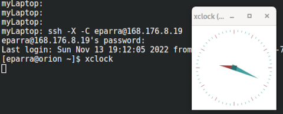

.. _Ingreso:

Iniciar sesión en el HPC del CECC
###################

La federacion de clusters del CECC usa un cortafuegos que aisla el sistema de la Internet y solo usuarios e IPs incluidas de una lista permitida pueden acceder. 

Antes de que pueda iniciar sesión en el HPC, debe establecer una contraseña y aceptar las normas de uso acerca de la administracion de identidad  publicadas en el Portal `URL <https://cecc.unal.edu.co/solicitud_proyecto />`_  haciendo uso de la cuenta y  contraseña que sera entregada al Director del grupo de Investigacion y proyecto.

El cortafuegos del HPC solo permite conexiones SSH entrantes; ssh o scp desde el HPC a otros nodos externos al campus está deshabilitado y debe ser solicitado por parte del Director del grupo de investigacion en  `URL <https://cecc.unal.edu.co/solicitud_proyecto />`_. 

La Federacion de Cluster del CECC usa nodos de inicio de sesión para el acceso interactivo y para el envío de trabajos por lotes. 

Ingreso
####
Coneccion usando ssh
********************

Para acceder( `loguearse <https://es.wikipedia.org/wiki/Login>`_ )  al HPC del `CECC <https://cecc.unal.edu.co>`_ usted debe usar `ssh (Secure SHell) <https://web.mit.edu/rhel-doc/4/RH-DOCS/rhel-rg-es-4/ch-ssh.html>`_, esta via facilita la comunicacion entre computadoras.
Computadoras con sistema operativo `GNU/Linux <https://www.gnu.org/home.es.html>`_ o MacOS vienen con un cliente ssh que puede usar en la linea de comandos(CLI).  Si usa windows existen varios clientes ssh (software) con los que puede conectarse. 

Para conectarse usando MacOS o GNU/Linux al nodo de ingreso del CECC, ejecute una terminal y escriba el comando *ssh* seguido de *su usuario@168.176.8.19*  

.. image:: images/conect1.png
    :width: 600px
    :align: center
    :height: 67px
    :alt: Linux terminal image

Aunque la mayoria de los usuarios usan este metodo con contrasena, debido a riesgos de seguridad nosotros le sugerimos usar el metodo de autentificacion con Clave Publica.

Iniciar sesiones GUI con ssh
*************************

Este procedimiento es dependiente del ancho de banda del que dispone el usuario y, normalmente es eficiente cuando se usan maquinas conectadas fisicamente a la red del campus.  

Para proporcionar ambientes graficos en sesiones ssh debe adicionar parametro "-X",  tambien puede adicionar el parametro "-C" para comprimir la informacion  que envia a traves de la red.   Puede verificar que habilito ambientes graficos o "X" ejecutando el programa "xclock".

    
Debe iniciar sesion en el nodo de acceso permitiendo "X",  para ello use *ssh* con el parametro "-X"   hasta llegar al nodo de envio y desde alli 

puede iniciar una sesion iteractiva con srun::

 *srun -M biocomputo --x11  -p cpu.normal.q -w hercules2 --pty bash -i*
 
Clientes SSH para windows
************************

`MobaXterm <https://mobaxterm.mobatek.net/download.html>`_

MobaXterm es una herramienta que cuenta con un cliente SSH  y otras caracteristicas  como multi ejecución (ejecutar el mismo codigo en varios servidores a la vez) y compatibilidad con ventanas graficas(X11 forwarding). 

Para conectarse, una vez ha seleccionado el cliente SSH, aparecerá un recuadro donde deberá introducir la dirección IP 168.176.8.19.

.. image:: /images/Moba/mobases2.PNG
    :width: 600
    :align: center
    :height: 403
    :alt: MobaXterm tutorial
 
luego  en la ventana emergente debera ingresar el usuario y/o contraseña suministrada. 

`PuTTY <https://www.chiark.greenend.org.uk/~sgtatham/putty/latest.html>`_

Putty es un cliente SSH que requiere pocos recursos y permite crear llaves SSH.  Una vez abierto el programa,  deberá ingresar la dirección IP 168.176.8.19  y verificar que el tipo de conexión  sea *SSH* y el puerto corresponda a 22.

.. image:: /images/Putty/Putty.PNG
    :width: 452px
    :align: center
    :height: 442px
    :alt: Putty tutorial
    
Luego  en la ventana emergente debera ingresar el usuario y/o contraseña suministrada. 