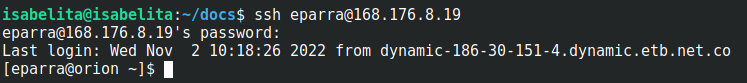

.. _Ingreso:

Ingreso
=======
Coneccion usando ssh
############

Para acceder( `loguearse <https://es.wikipedia.org/wiki/Login>`_ )  al HPC del `CECC <https://cecc.unal.edu.co>`_ usted debe usar `ssh (Secure SHell) <https://web.mit.edu/rhel-doc/4/RH-DOCS/rhel-rg-es-4/ch-ssh.html>`_, esta via facilita la comunicacion entre computadoras que usan sistemas operativos GNU/Linux;  para hacer esto used debe tener el software ssh(cliente ssh).  Computadoras con sistema operativo `GNU/Linux <https://www.gnu.org/home.es.html>`_ o MacOS vienen con un cliente ssh de linea de comandos(solo texto).  En windows existen varios clientes con los que puede conectarse.

Instalar un cliente SSH
############
Si usted usa alguna distribución de `GNU/Linux <https://www.gnu.org/home.es.html>`_ o  `MacOS (Antes OSX) <https://www.apple.com/co/macos/monterey/>`_, su sistema operativo ya cuenta con un cliente SSH que puede usar en una  terminar; en caso de usar una computadora con `Windows <https://www.microsoft.com/es-xl/windows>`_ será necesario instalar un cliente SSH

Clientes SSH para windows:
************************

`MobaXterm <https://mobaxterm.mobatek.net/download.html>`_

.. image:: /images/Moba.png
    :width: 600px
    :align: center
    :height: 331px
    :alt: MobaXterm image
    
MobaXterm es una herramienta para coneccion remota, cuenta con un cliente SSH  y otras caracteristicas  como multi ejecución (ejecutar el mismo codigo en varios servidores a la vez) y compatibilidad con ventanas graficas(X11 forwarding). 

`PuTTY <https://www.chiark.greenend.org.uk/~sgtatham/putty/latest.html>`_

.. image:: /images/Putty.PNG
    :width: 452px
    :align: center
    :height: 442px
    :alt: PuTTY image

Putty es un cliente SSH que requiere pocos recursos y permite crear llaves SSH, es una alternativa en caso de que el usuario cuente con una maquina con recursos limitados. 

MacOS y GNU/Linux
******************

Para conectarse usando MacOS o GNU/Linux abra una terminal y escriba el comando *ssh* seguido de *su usuario@168.176.8.19* : 

Si ha seguido los pasos correctamente, tendá acceso al HPC del CECC.  

Windows
********

**Conectarse usando PuTTY**

Una vez abierto el programa aparecerá el siguiente menú:

.. image:: /images/Putty.PNG
    :width: 452px
    :align: center
    :height: 442px
    :alt: Putty tutorial
 

En este menú deberá ingresar la dirección IP HPC del CECC y seleeciónar el tipo de conexión *SSH*

.. image:: /images/Putty/Putty.PNG
    :width: 452px
    :align: center
    :height: 442px
    :alt: Putty tutorial
    
    
Una vez de click en *Open*, la primera vez que se conecte a cualquier sevidor aparecerá una ventana como la que se muestra a continuacón (esto es totalmente normal y tiene como objetivo que su computador guarde un identificador para que la proxima vez que usted se trate de conectar al sevidor usando la misma dirección IP su computadora pueda verificar que es el mismo al que se conecto previamente), para continuar solo de click en *Accept*.    

.. image:: /images/Putty/putty3.PNG
    :width: 611px
    :align: center
    :height: 418px
    :alt: Putty tutorial

Ahora saldrá está ventana donde se le pedira que ingresé el usuario y contraseña que el administrador le haya suministrado: 

.. image:: /images/Putty/putty4.PNG
    :width: 611px
    :align: center
    :height: 418px
    :alt: Putty tutorial
   
   
Si ha seguido los pasos correctamente, tendá acceso al HPC del CECC.    

**Conectarse usando MobaXterm:**

Una vez abierto el programa aparecerá el siguiente menú:

.. image:: /images/Moba.png
    :width: 600px
    :align: center
    :height: 331px
    :alt: MobaXterm tutorial

En este menú deberá dar click en el botón de sesiones: 

.. image:: /images/Moba/Moba.PNG
    :width: 600px
    :align: center
    :height: 331px
    :alt: MobaXterm tutorial

Cuando vez oprima dicho botón, aparecerá un menú donde debrá seleccionar el tipo protocolo que desea usar, en este caso deber seleccionar *SSH*: 

.. image:: /images/Moba/Mobases.PNG
    :width: 600
    :align: center
    :height: 402
    :alt: MobaXterm tutorial

Una vez seleccionado SSH, aparecerá un recuadro donde deberá introducir la dirección IP del HPC del CECC

.. image:: /images/Moba/mobases2.PNG
    :width: 600
    :align: center
    :height: 403
    :alt: MobaXterm tutorial
 
 
Despues de haber introducido la dirección IP, saldrá este recuadro donde se le pedira que ingresé el usuario y contraseña que el administrador le haya suministrado: 

.. image:: /images/Moba/mobases4.PNG
    :width: 600
    :align: center
    :height: 334
    :alt: MobaXterm tutorial
 

Si ha seguido los pasos correctamente, tendá acceso al HPC del CECC.  
